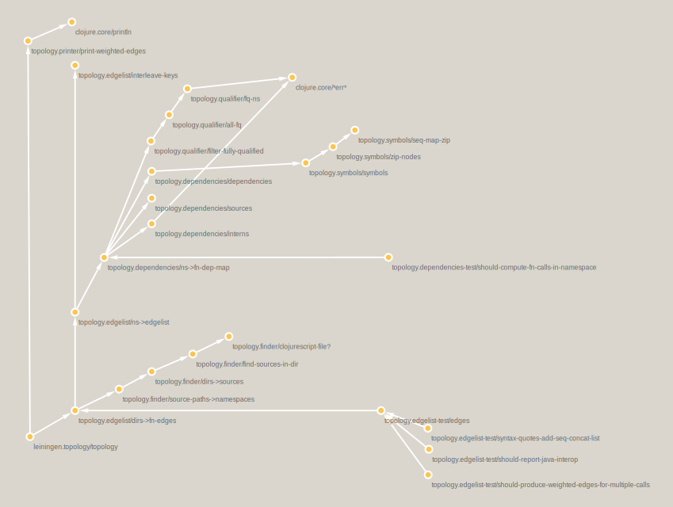

# lein-topology

`lein topology` generates data representing a Clojure project's function [dependency structure matrix](https://en.wikipedia.org/wiki/Design_structure_matrix) (DSM). Data is output to `stdout` in the format `source,target,weight` and should be interpreted as `ns/source-function` calls `ns/target-function` `weight` times in the library or application.

Use `lein topology` to "collect the dots"...you can "connect the dots" to visualize, filter, and analyze with the tools of your choice, regardless of whether or not those tools are written in Clojure. Decoupling network data collection and analysis distinguishes `lein topology` from the numerous other projects and `lein` plugins that create namespace or function graphs and produce artifacts like diagrams rather than raw data.


## Usage

[](https://clojars.org/lein-topology)

Add `lein-topology` to the `:plugins` vector of your `:user` profile in `~/.lein/profiles.clj`:

```clojure
{:user {:plugins [[lein-topology "0.2.0"]]}}
```

Alternatively you may add the plugin to your `project.clj`:

```clojure
(defproject sample
  :dependencies [[org.clojure/clojure "1.8.0"]]
  :profiles {:dev {:plugins [[lein-topology "0.2.0"]]}})
```

`cd` into the project directory and run `lein topology`.

Given a function declaration like:

```clojure
(defn print-weighted-edges
  [edges]
  (doseq [[[outv inv] w] edges]
    (println (str/join "," [outv inv w]))))
```

The output will look like:

    topology.core/print-weighted-edges,clojure.core/defn,1
    topology.core/print-weighted-edges,clojure.core/doseq,1
    topology.core/print-weighted-edges,clojure.core/println,1
    topology.core/print-weighted-edges,clojure.string/join,1

Edges are printed to `stdout` and output can be redirected to a file, e.g. `lein topology > /tmp/topology.csv`. Any errors will be printed to `stderr`, and will not appear in the redirected file output on a Unix-based system.

You now have a directed graph of functions that call other functions in the code base represented as weighted edges. Edges from test paths are included, as these are useful for many types of analysis.


## Example application: Generating architecture diagrams from dependency networks

This is the dependency structure of `lein topology`:



This diagram was created with data obtained by running `lein-topology` on itself using [sandbook](https://www.github.com/bobbyno/sandbook), v360dd2b.

The visulization was designed to highlight several attributes of the system:

* The flow of control starts in the lower left-hand side at the `leiningen.topology/topology` function and flows across paths up and to the right in a depth-first traversal. A new developer wanting to work on `lein-topology` could start with this diagram as a map of the project's backbone.

* The five namespaces in this library are arranged to be in close proximity. The functions could easily be clustered by namespace to simplify the visualization even further...were there more vertices, this step would be essential.

* The program is a tree...a directed acyclic graph. There are several "hidden modules" that can be replaced, for example the zipper implementation in `topology.symbols`.

* Test vertices and edges are arranged on the right and provide an indicator of test coverage.

* Vertices and edges from namespaces outside of the library were removed.

Architecture diagrams provide a compact visual description of complicated engineered systems that allows for quick exploratory analysis and pattern recognition. Like comments, however, they are prone to being out of sync with the actual code. It would be preferable to generate these diagrams automatically as observed 'ground truth' about the system's structure.

Fully automated visualization workflows are possible with Cytoscape thanks to its RESTful API. See the [sandbook](https://www.github.com/bobbyno/sandbook) project for more information.

## Is this a control flow graph?

A [control flow graph](https://en.wikipedia.org/wiki/Control_flow_graph) (CFG) represents all paths that might be traversed through a program during its execution. If A and B are nodes in a CFG, an edge exists from A to B if and only if the function B can be executed immediately after the function A. Although all vertices necessary for a CFG are present in the `lein-topology` output, the edges in this case represent the fact that a function B is called at some point in the implementation of function A, and therefore A depends on B. A CFG would be a richer representation, but is difficult to obtain. The above diagram approximates the CFG, but was layed out manually to achieve that effect. It would be interesting to determine if an accurate CFG could be generated with the approach in `lein-topology`.


## Acknowledgments

Contributors of merged PR's and those who file issues are credited in [NOTICE.txt](./NOTICE.txt).

[lein-hiera](https://github.com/greglook/lein-hiera) generates a Graphviz representation of namespace dependencies. The `topology.finder` namespace includes four functions from `lein-hiera` to find Clojure source files and namespaces.

[lein-clique](https://github.com/Hendekagon/lein-clique) by Matthew Chadwick generates a Graphviz or map representation of functions in a namespace to the functions they depend on. The `topology.dependencies` namespace uses several functions from `lein-clique` to generate a similar dependency map, then transforms it to a `source,target,weight` edgelist format. `lein-topology` is mostly just a simpler version of the [0.1.2 version](https://github.com/Hendekagon/lein-clique/blob/a71845a69f8c0ce9724b217e82ae8ce47012fa39/src/clique/core.clj) of `lein-clique`, though the differences of where I wanted to go with the library and `lein-clique`'s current `master` branch were significant enough to warrant a new library.


## License

Copyright © Bobby Norton and [Tested Minds, LLC](http://www.testedminds.com).

Released under the [Apache License, Version 2.0](./LICENSE.txt)
